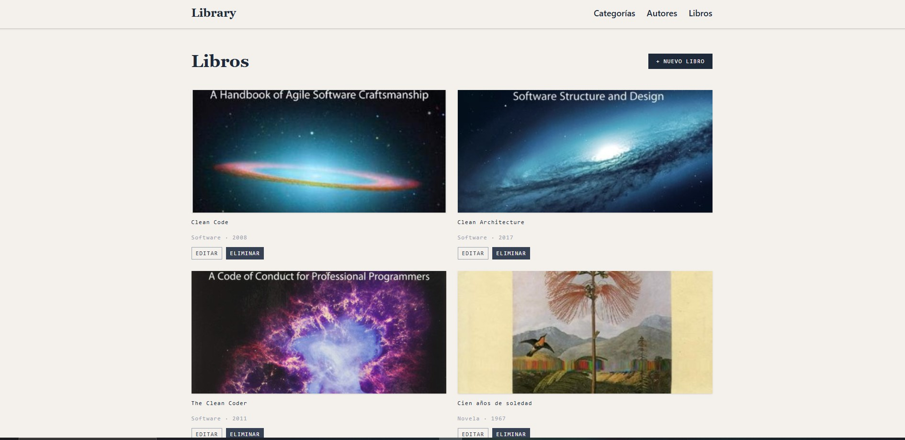
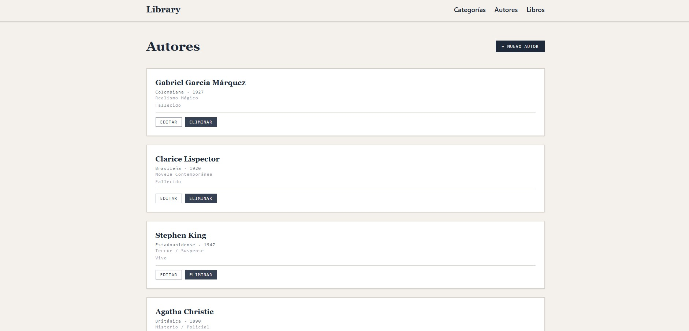
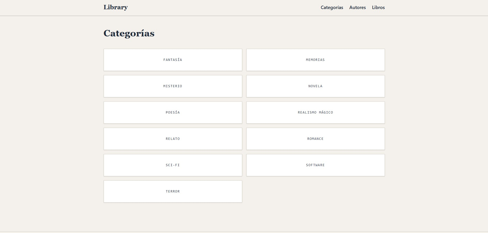
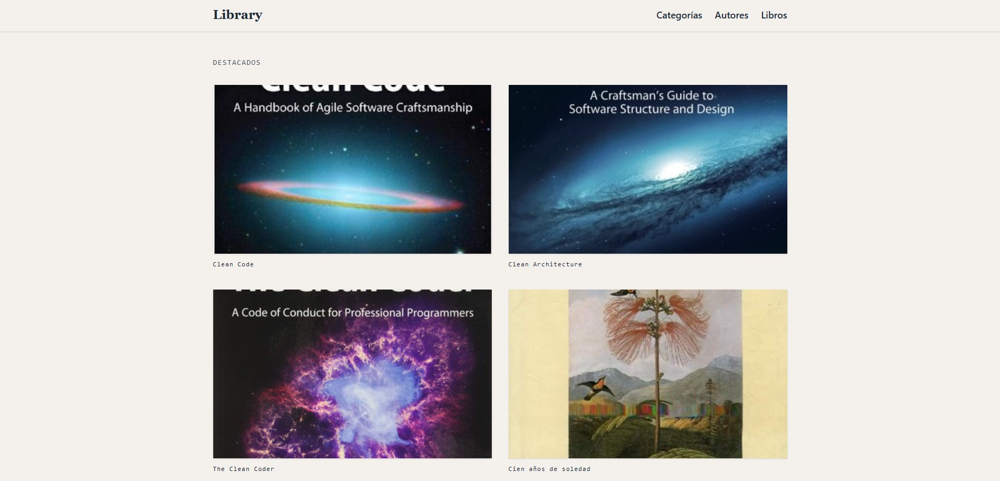

# 📚 Library Project - Frontend

Bienvenido al repositorio oficial de la interfaz de usuario para **Library**. Aplicación web completa para la gestión de una biblioteca digital con autores, libros y categorías, conectada a una API REST en Spring Boot + MySQL.

---

## 📸 Vista Previa

### Home
<div align="center">
  
  <p><i>Página de inicio con carrusel y banner de libros reales desde la base de datos</i></p>
</div>

> 📷 Añade capturas de las páginas de Libros, Autores y Categorías en la carpeta `docs/`

   
---

## 🛠️ Stack Tecnológico

- **React 19** — Framework principal de la interfaz
- **Vite 8** — Bundler y servidor de desarrollo optimizado
- **Tailwind CSS 4** — Estilos con diseño responsivo
- **React Router Dom 7** — Navegación y gestión de rutas
- **Axios 1.14** — Cliente HTTP con proxy configurado para evitar CORS

---

## 🚀 Requisitos previos

- Node.js 18+
- Backend de Library corriendo en `http://localhost:8080`
- Base de datos MySQL con la base de datos `library`

> Consulta el README del backend para arrancar la API y configurar la base de datos.

---

## 💻 Instalación y Configuración Local

1. **Clonación del repositorio:**
   ```bash
   git clone https://github.com/ResilenteMG/mi-biblioteca-front.git
   ```

2. **Instalación de dependencias:**
   ```bash
   cd mi-biblioteca-front
   npm install
   ```

3. **Ejecución del servidor local:**
   ```bash
   npm run dev
   ```

La app estará disponible en `http://localhost:5173`.

> ⚠️ El backend debe estar corriendo **antes** de arrancar el frontend.

---

## 📐 Diseño y Organización

El desarrollo visual se guio por:
- **UI/UX:** Prototipos de alta fidelidad en **Figma**
- **Gestión de Proyecto:** Organización de tareas y sprints mediante **Jira**

---

## 📁 Estructura del Proyecto

```
src/
├── components/
│   ├── banner/
│   │   └── Banner.jsx          # Sección de portadas en Home (datos reales)
│   ├── carousel/
│   │   └── Carousel.jsx        # Carrusel automático de libros destacados
│   ├── footer/
│   │   └── Footer.jsx          # Pie de página común a todas las vistas
│   └── navbar/
│       └── Navbar.jsx          # Cabecera con navegación principal
├── pages/
│   ├── Authors/
│   │   ├── AuthorList.jsx      # Listado de autores con editar/eliminar
│   │   └── AuthorForm.jsx      # Formulario crear y editar autor
│   ├── Books/
│   │   ├── BookList.jsx        # Listado de libros con portadas
│   │   └── BookForm.jsx        # Formulario crear y editar libro
│   ├── CategoryList.jsx        # Listado de categorías únicas
│   ├── CategoryBooks.jsx       # Libros filtrados por categoría
│   └── Home.jsx                # Página de inicio
├── services/
│   ├── authorService.jsx       # Llamadas a la API de autores
│   └── bookService.jsx         # Llamadas a la API de libros
├── App.jsx                     # Enrutador principal
├── main.jsx                    # Punto de entrada
└── index.css                   # Estilos globales
```

---

## 🗺️ Rutas de la Aplicación

| Ruta | Descripción |
|------|-------------|
| `/` | Home con carrusel y banner de libros |
| `/categories` | Listado de categorías literarias |
| `/categories/:category` | Libros filtrados por categoría |
| `/authors` | Listado completo de autores |
| `/authors/new` | Formulario para crear un autor |
| `/authors/:id/edit` | Formulario para editar un autor |
| `/books` | Listado completo de libros con portadas |
| `/books/new` | Formulario para crear un libro |
| `/books/:id/edit` | Formulario para editar un libro |

---

## 🔌 Conexión con el Backend

La app se comunica con la API REST a través de un proxy configurado en Vite que redirige todas las peticiones `/api` al backend, eliminando los problemas de CORS en desarrollo:

```js
// vite.config.js
server: {
  proxy: {
    '/api': {
      target: 'http://localhost:8080',
      changeOrigin: true,
    },
  },
},
```

### Servicios disponibles

**Authors** — `src/services/authorService.jsx`

| Función | Método | Endpoint |
|---------|--------|----------|
| `getAuthors()` | GET | `/api/authors` |
| `getAuthorById(id)` | GET | `/api/authors/{id}` |
| `createAuthor(data)` | POST | `/api/authors/new` |
| `updateAuthor(id, data)` | PUT | `/api/authors/{id}` |
| `deleteAuthor(id)` | DELETE | `/api/authors/{id}` |
| `getAuthorsByCategory(cat)` | GET | `/api/authors/category/{category}` |

**Books** — `src/services/bookService.jsx`

| Función | Método | Endpoint |
|---------|--------|----------|
| `getBooks()` | GET | `/api/books` |
| `getBookById(id)` | GET | `/api/books/{id}` |
| `createBook(data)` | POST | `/api/books` |
| `updateBook(id, data)` | PUT | `/api/books/{id}` |
| `deleteBook(id)` | DELETE | `/api/books/{id}` |
| `getBooksByCategory(cat)` | GET | `/api/books/category/{category}` |

---

## ✏️ Scripts Disponibles

| Comando | Descripción |
|---------|-------------|
| `npm run dev` | Arranca el servidor de desarrollo |
| `npm run build` | Genera el build de producción |
| `npm run preview` | Previsualiza el build de producción |
| `npm run lint` | Ejecuta el linter ESLint |

---

<br>
<hr>
<div align="center">

## 👥 Equipo de Desarrollo

Un proyecto orgullosamente desarrollado por:

**Melissa Gómez** (Product Owner) | **Alberto García** (Scrum Master) | **Juan Luis Márquez** (Fullstack) | **Hebert París** (Fullstack) | **Sergio Fernández** (Fullstack)

---

Developed in collaboration with:

### 🚀 **Factoría F5** 🚀

---

Copyright © 2026 — Library Project

</div>
<hr>
